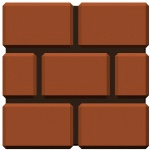

# 🎮 Game Storming HTML5 Canvas

Um exemplo simples de jogo usando HTML5 Canvas e JavaScript puro para demonstrar os conceitos básicos de desenvolvimento de jogos no navegador.



## 📋 Descrição

Este projeto é um exemplo básico de como criar um jogo 2D no navegador usando o elemento Canvas do HTML5. O jogo demonstra:

- Renderização de sprites e imagens
- Controle de movimento via teclado
- Loops de atualização e renderização
- Animações simples

## 🚀 Como Executar

Para executar o jogo localmente, siga estas etapas:

1. Clone o repositório:
   ```bash
   git clone https://github.com/Code-e-Cafe/game
   cd game
   ```

2. Inicie um servidor HTTP local (escolha uma das opções):

   **Usando Python 3:**
   ```bash
   python3 -m http.server 8000
   ```

   **Usando PHP:**
   ```bash
   php -S localhost:8000
   ```

   **Usando Node.js:**
   ```bash
   npx http-server -p 8000
   ```

3. Acesse o jogo no navegador:
   ```
   http://localhost:8000
   ```

> ⚠️ **Importante**: É necessário usar um servidor HTTP local para executar o jogo. Abrir o arquivo HTML diretamente no navegador pode causar problemas de CORS.

## 🛠️ Estrutura do Projeto

```
game/
├── assets/
│   ├── css/
│   │   └── main.css
│   ├── img/
│   │   ├── background-mario.png
│   │   └── block-brick.png
│   └── js/
│       ├── canvas.js      # Classe para manipulação do canvas
│       ├── enums.js       # Constantes e enumerações
│       ├── keyboard.js    # Gerenciamento de input do teclado
│       ├── main.js        # Script principal e loops do jogo
│       ├── player.js      # Classe do jogador
│       └── sprite.js      # Classe para renderização de sprites
├── index.html            # Página principal do jogo
└── README.md             # Este arquivo
```

## 🕹️ Controles

- **Setas direcionais**: Movem o jogador pela tela
- **Espaço**: [Ação adicional, se implementada]

## 🧩 Componentes Principais

### Canvas.js
Gerencia o elemento canvas HTML5 e seu contexto de renderização 2D.

### Keyboard.js
Detecta e gerencia eventos de teclado para controle do jogador.

### Sprite.js
Fornece funcionalidades para renderizar imagens e sprites no canvas.

### Player.js
Implementa a lógica do jogador, incluindo movimento e interações.

### Main.js
Contém os loops principais do jogo:
- Loop de renderização (60 FPS)
- Loop de atualização de física (100 TPS)
- Loop de animação (7 APS) [a ser implementado]

## 🧪 Tecnologias Utilizadas

- HTML5 Canvas
- JavaScript (ES5+)
- jQuery (para manipulação DOM)

## 🔄 Loops do Jogo

O jogo utiliza três loops separados:

1. **Frame Draw Loop (FPS)**: Responsável por limpar o canvas e renderizar todos os elementos visuais.
2. **Update Loop (TPS)**: Atualiza a lógica do jogo, como posição do jogador e colisões.
3. **Animation Loop (APS)**: Gerencia as animações dos sprites (a ser implementado).

## 📝 Todo

- [ ] Implementar sistema de colisão
- [ ] Adicionar mais sprites e animações
- [ ] Implementar sistema de pontuação
- [ ] Adicionar efeitos sonoros
- [ ] Implementar menu inicial
